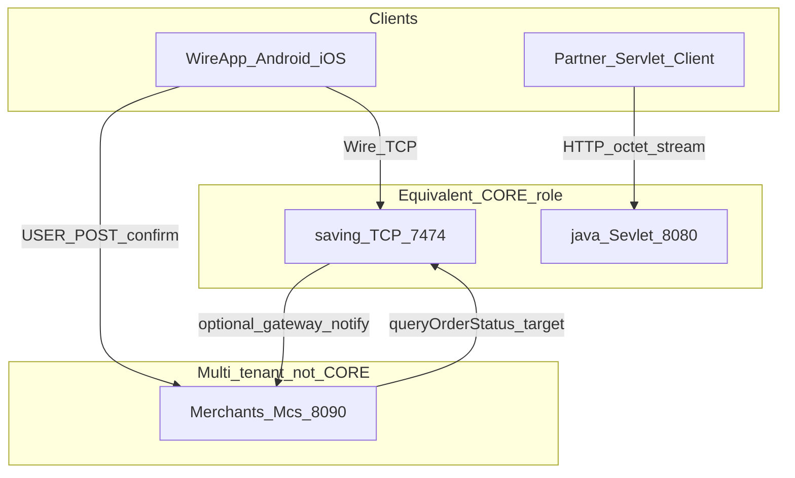

# ADR 004: Dual CORE rails — `java/` (Sevlet servlet) and `saving/` (Wire TCP)

## Status

Accepted (documentation only — no code merge in this phase)

## Context

The monorepo contains **two payment engines** built for the same product domain (wallet, intents, idempotency, multi-tenant `mid`), at different times and transports:

1. **[`java/`](../../java/)** — built first: **Sevlet Wallet** (Jakarta Servlet, HTTP `POST /sevlet/wallet/payload`, `SevletWalletCodec`, WAL, `led_payment`, double-entry `acct_journal_*`).
2. **[`saving/`](../../saving/)** — built for the **Wire superapp**: C Wire TCP server (port 7474), [`wire.h`](../../saving/include/wire.h), `payment_intents`, session-based mobile clients.

In conversation, “**one thing = saving**” means: for **Wire App / Mc / QR pay**, the canonical money rail is **`saving`**. The **`java`** folder remains **equivalent in role** (CORE payment + ledger), not duplicate or deprecated — it is the canonical rail for **servlet / partner binary POST** clients.

[ADR 003](003-neo-bank-mid-and-merchant-id.md) describes the servlet pipeline as “single brain”; this ADR scopes that claim **per rail** so docs do not imply only one codebase owns all money in the repo.

## Decision

### 1. Two parallel CORE rails (same role, different transport)

| Aspect | Servlet rail — [`java/`](../../java/) | Wire rail — [`saving/`](../../saving/) |
|--------|--------------------------------------|----------------------------------------|
| Transport | HTTP, `application/octet-stream` | TCP persistent, framed HMAC |
| Codec | [`SevletWalletCodec`](../../java/src/main/java/dev/nivic/sevlet/SevletWalletCodec.java) | [`wire.h`](../../saving/include/wire.h) / `WireFrame.kt` |
| Order / intent table | `led_payment` | `payment_intents` |
| Idempotency | `(mid, request_id)` + `wallet_idempotency` | `(mid, request_id)` PK |
| Journal (double-entry) | `acct_journal_entry` / `_line` | transfer + C ledger append |
| Primary clients | Partner POST, hot-path tests, enterprise | `wire-android/`, `saving-ios/` |
| Default port | 8080 (dev) | 7474 TCP |

**Do not merge tables** without an explicit bridge. See [payment-flow-miniapp.md](../payment-flow-miniapp.md).

### 2. Client routing rules

| Client / flow | Canonical CORE rail |
|---------------|---------------------|
| Wire App (Android / iOS) | **`saving`** (Wire TCP) |
| Mc QR pay, `CONFIRM_INTENT`, `payment_intents` | **`saving`** |
| Mcs order confirm / `gateway_notify` (today) | **`saving`** side effects + Mcs HTTP |
| Partner `POST /sevlet/wallet/payload` | **`java`** |
| WAL replay, servlet hot-path tests, full journal projection | **`java`** |
| [`saving-gateway`](../../saving-gateway/) HTTP `/wire/*` | Proxies to **`saving`** (not java) |

### 3. Shared multi-tenant namespace

Both rails use the same **`mid`** / **`merchant_id`** semantics ([ADR 003](003-neo-bank-mid-and-merchant-id.md)). **[`Merchants/`](../../Merchants/)** (Mcs) is **not** CORE: it holds Mc orders and UI; authoritative balances live on the chosen rail.

### 4. Architecture (logical)

## Consequences

- Documentation must qualify “CORE” or “SoT” with **which rail** (Wire vs servlet).
- Fuzzers, code generators, and integration tests must target the **correct codec** ([ADR 001](001-sevlet-wallet-wire.md) vs Wire TCP opcodes).
- Operations may run **two PostgreSQL schemas** (java wallet schema vs saving DB); BI must tag source tables.
- [PRODUCT_PRINCIPLES §9–10](../PRODUCT_PRINCIPLES.md): full double-entry journal narrative applies to the **java rail**; saving uses transfer + C ledger projection unless/until aligned.

## Out of scope (this ADR)

- Bridge or sync between `payment_intents` and `payment_ledger`
- Implementing `queryOrderStatus` on saving (see [wire-payment-multitenant.md](../architecture/wire-payment-multitenant.md) backlog)
- Deprecating or merging either rail in code

## Related

- [ADR 001: Sevlet wallet wire](001-sevlet-wallet-wire.md)
- [ADR 003: Neo-bank `mid`](003-neo-bank-mid-and-merchant-id.md) — servlet rail scope
- [Wire payment + multi-tenant](../architecture/wire-payment-multitenant.md)
- [Wire ≠ MoMo](../wire-vs-momo.md) — two stacks table
- [`java/README.md`](../../java/README.md), root [`README.md`](../../README.md)
