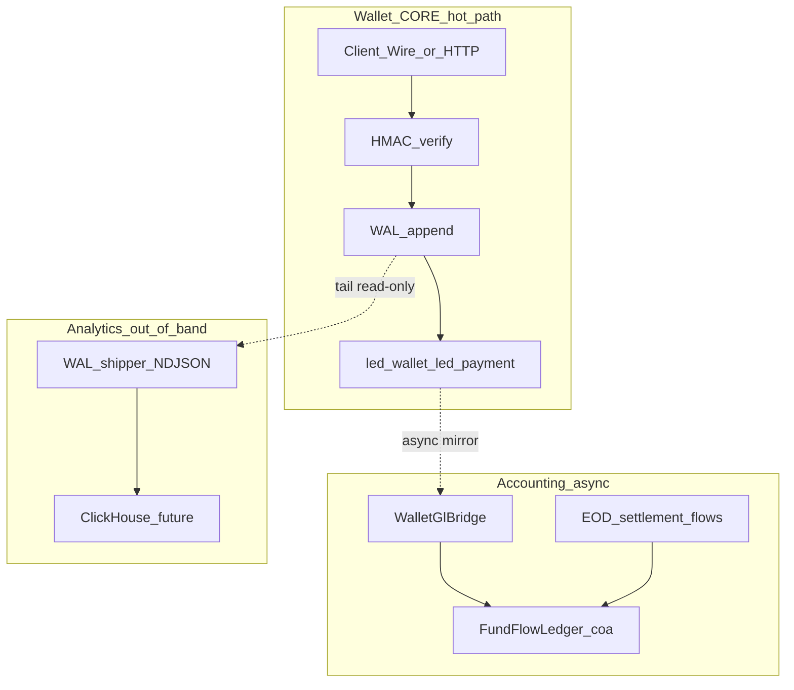

# ADR 005: Ranh giới Ví (Wallet) vs Sổ cái (Accounting)

## Status

Proposed — **thiết kế trước khi mở rộng code**. Team review trước Phase implementation.

## Context

Stakeholder yêu cầu **thiết kế trước, code sau**. Trên nivic có **hai tính năng lớn** thường bị gộp nhầm:

1. **Ví (Wallet / CORE)** — chấp nhận lệnh thanh toán, idempotency, WAL, số dư party theo `mid`, intent hai pha.
2. **Sổ cái (Accounting / GL)** — hạch toán kép theo **Chart of Accounts**, transit, nạp/rút, EOD settlement, đối soát ngân hàng.

Repo **đã có cả hai lớp** ở `java/` (và rail Wire ở `saving/`), nhưng **chưa có một ADR thống nhất** giải thích ranh giới, thứ tự triển khai, và quy tắc “ai là nguồn sự thật”.

## Decision

### 1. Hai bounded context — không một bảng “số dư duy nhất”

| | **Ví (Wallet CORE)** | **Sổ cái (Accounting / COA)** |
|---|----------------------|-------------------------------|
| **Câu hỏi trả lời** | “Lệnh này đã được Core chấp nhận chưa? Party A → Party B bao nhiêu?” | “Tiền đi qua tài khoản nào trên COA? Transit đã clear chưa? EOD đã settle chưa?” |
| **Đơn vị** | `mid` (party), `request_id`, opcode wire | Mã tài khoản (`2110`, `3100`, …), `coa_trans.ref_id` |
| **SoT (servlet rail)** | WAL + `led_wallet` + `led_payment` | `coa_account` + `coa_trans` + `coa_trans_data` |
| **Hot path** | Có — P95 accept/settle | **Không** — async mirror / batch fund-flow |
| **Đối tượng dùng** | App, partner POST, Wire | Ops, finance, ngân hàng, báo cáo regulator |
| **Prefix DB (java)** | `led_*`, `wallet_*`, `acct_journal_*` (journal vận hành) | `coa_*` |
| **Code chính** | `WalletAcceptService`, `LedgerService`, `PaymentLedger` | `FundFlowLedger` / `JdbcFundFlowLedger`, `WalletGlBridge` |

**Quy tắc vàng:** Ví **không** thay thế sổ cái platform; sổ cái **không** quyết định accept/reject payload trên hot path.

### 2. Ba lớp kế toán trong servlet (đừng nhầm)

```
┌─────────────────────────────────────────────────────────────┐
│  L1 — Ví vận hành (operational ledger)                      │
│  led_wallet, led_payment, acct_account_hold                 │
│  “Message đã accept → projection theo mid/request_id”       │
├─────────────────────────────────────────────────────────────┤
│  L2 — Bút toán vận hành (optional per deployment)           │
│  acct_journal_entry / acct_journal_line                     │
│  DR/CR account_id trên cùng wire amount (party legs)        │
├─────────────────────────────────────────────────────────────┤
│  L3 — Sổ cái COA platform (fund-flow / GL)                  │
│  coa_* — GtelPay-style chart, transit, EOD, MDR             │
│  Mirror từ ví qua WalletGlBridge HOẶC luồng fund-flow riêng │
└─────────────────────────────────────────────────────────────┘
```

- **L1** = SoT cho **trạng thái thanh toán** (ADR 003).
- **L2** = double-entry **theo party** (debit/credit account id trên wire) — bật/tắt qua servlet init.
- **L3** = **sổ cái tài chính nền tảng** — nạp Vietinbank, transit 3100, merchant 2120, EOD clearing 3800, v.v.

Triển khai mới **phải nói rõ** đang chạm L1, L2 hay L3.

### 3. Rail Wire (`saving/`) vs servlet (`java/`)

| | Wire rail | Servlet rail |
|---|-----------|--------------|
| Ví | `payment_intents`, transfer, C ledger | `led_*`, WAL |
| Sổ cái COA | **Chưa** gắn mặc định | `coa_*` + `JdbcFundFlowLedger` |
| Bridge | Backlog: export event → COA (không merge bảng) | `WalletGlBridge` (mirror → 2110) |

[ADR 004](004-dual-core-rails-java-and-saving.md): hai rail **cùng vai trò CORE**, **khác transport và schema**. Accounting platform (L3) hiện **gắn servlet DB**; Wire cần **event bridge** nếu muốn một COA thống nhất.

### 4. Luồng dữ liệu (target)



- **Không** gọi `FundFlowLedger.postJournal()` trong thread accept servlet.
- **Có** hook async sau persist ví (`WalletAcceptService` + executor) — pattern đã có trong test `WalletAcceptMirrorTest`.

### 5. Idempotency — hai namespace

| Layer | Key | Ghi chú |
|-------|-----|---------|
| Ví | `(mid, request_id)` + `wallet_idempotency` | Trước/trong accept; xem backlog ADR 003 |
| COA mirror | `coa_trans.ref_id` = `WAL:{mid}:{request_id}` | `WalletGlBridge.ref()` |
| COA fund-flow | `ref_id` = bank ref / EOD ref riêng | Top-up, IBFT, QR/POS, EOD |

Retry mirror COA **không** được double-post; retry ví **không** được giả định COA đã mirror.

### 6. Phạm vi thiết kế trước khi code (checklist review)

#### A. Ví (Wallet)

- [ ] Rail nào? (Wire / servlet / cả hai — routing ADR 004)
- [ ] Opcode / command matrix (transfer, intent, confirm, reversal)
- [ ] Idempotency + order_id policy per `mid`
- [ ] WAL signing (NVW2) prod keys
- [ ] Holds (`acct_account_hold`) khi nào reserve / release
- [ ] **Không** đưa COA transit vào hot path

#### B. Sổ cái (Accounting)

- [ ] Luồng nào trên COA? (mirror ví only vs full fund-flow doc Fund+Flow)
- [ ] Chart of accounts frozen list (`coa_account` seed) — ai sửa account mới?
- [ ] Transit invariant: 3100/3200/… = 0 sau luồng hoàn tất
- [ ] EOD: ai trigger (cron / Ops / manual)?
- [ ] Đối soát: `ReconciliationReport` (led_wallet ↔ coa ref)
- [ ] Báo cáo tài chính **đọc COA**, không đọc `led_wallet` trực tiếp

#### C. Chung

- [ ] Analytics đọc WAL/events — không SoT ([nivic-analytics-pipeline](../architecture/nivic-analytics-pipeline.md))
- [ ] Mcs `orders` — **không** SoT tiền; poll CORE
- [ ] Multi-currency: ví có `currency_code`; COA hiện default VND

### 7. Thứ tự triển khai đề xuất

| Phase | Ví | Sổ cái | Ghi chú |
|-------|-----|--------|---------|
| **0 — Design** | ADR 003/004/005 sign-off | Fund-flow use cases map → `FundFlowLedger` API | **Đang ở đây** |
| **1 — Ví ổn định** | Hot path + WAL + led_* tests green | Chỉ mirror (`WalletGlBridge`) behind flag | Không EOD prod |
| **2 — COA fund-flow** | — | TopUp, Withdraw, IBFT, QR/POS, EOD tests → staging | Đã có integration tests COA |
| **3 — Wire bridge** | saving export events | Map `wire.intent_settled` → COA (design only until bridge) | Không merge `payment_intents` ↔ `led_payment` |
| **4 — Ops / analytics** | WAL shipper ✅ | COA balances API read-only; ClickHouse | Phase 1 analytics MVP |

### 8. Anti-patterns (từ chối trong review)

1. **Một bảng `balance` dùng chung** cho app UI và báo cáo GL.
2. **Ghi COA trong transaction JDBC** cùng lúc accept ví (lock contention + latency).
3. **Dashboard Mc đọc `coa_2120`** thay vì trạng thái order + CORE poll.
4. **Merge schema saving + java** “cho tiện BI” mà không event layer.
5. **Sửa `coa_trans` / `coa_trans_data`** (immutable triggers) — chỉ reversal qua API mới.

## Consequences

- PR **Wallet** chỉ chạm `led_*`, `wallet_*`, accept path — reviewer check không leak COA sync.
- PR **Accounting** chỉ chạm `coa_*`, `FundFlowLedger`, bridge — reviewer check idempotency `ref_id`.
- Doc và slide dùng từ **“Ví”** vs **“Sổ cái”** nhất quán; tránh “ledger” mơ hồ.
- Wire rail cần backlog riêng nếu COA phải phản ánh 100% volume mobile.

## Related

- [ADR 003: Neo-bank `mid`](003-neo-bank-mid-and-merchant-id.md) — ví servlet SoT
- [ADR 004: Dual CORE rails](004-dual-core-rails-java-and-saving.md)
- [Nivic analytics pipeline](../architecture/nivic-analytics-pipeline.md)
- [Downstream event contract](../downstream-event-contract.md)
- Code: [`WalletGlBridge`](../../java/src/main/java/dev/nivic/coa/bridge/WalletGlBridge.java), [`JdbcFundFlowLedger`](../../java/src/main/java/dev/nivic/coa/JdbcFundFlowLedger.java)
