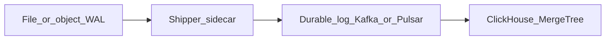

# WAL to analytics: ClickHouse vs ScyllaDB

This document describes a **reference pipeline** for turning append-only wallet WAL bytes into tenant-aware analytics. It is not wired into the Java runtime today; it informs operations and future connectors.

## Source: Core WAL

- Raw POST bodies (post-HMAC acceptance) append to the file WAL (`WalService` / `SimpleWalLog`), optionally wrapped in **NVW2** signed frames when Ed25519 keys are configured (`SignedWalVerifier`).
- Each record is an immutable proof of “what Core accepted”; replay reproduces ledger behavior.

## Recommended pipeline (OLAP-first)

1. **Tail or batch-read** WAL (NVW2-aware decoder if signed).
2. **Publish** to a durable log (Kafka/Pulsar) with partition key = **tenant / `mid` prefix`** (or hashed `mid`) to preserve per-tenant ordering where needed.
3. **Consumer** decodes `SevletWalletCodec`, extracts `mid`, `requestId`, `orderId`, `command`, `amount`, `debit`, `credit`, timestamps, and bounded `extraData` (or hashes it for PII).
4. **Bulk insert** into **ClickHouse** `MergeTree` with `(mid, toStartOfHour(ts))` or `(tenant_id, ts)` ordering for dashboard queries, funnels, and ad-hoc SQL.

**Why ClickHouse first:** columnar storage, excellent compression, fast aggregations over billions of rows, and natural fit for **event warehouses** and BI (per-tenant dashboards, drop-off on parked orders, amount histograms).

## When to add ScyllaDB (Cassandra-class)

Add **Scylla** (or Cassandra) when you need a **low-latency serving path** keyed by `(mid, request_id)` or `(tenant_id, bucket)` with high write rates and bounded range scans—for example **live risk**, **rate counters**, or **API-facing recent history**—rather than heavy OLAP.

Typical pattern:

- **ClickHouse** = canonical analytics + compliance exports.
- **Scylla** = hot read models materialized from the same stream (optional duplicate of a subset of fields).

Avoid choosing Scylla as the **only** analytics store unless query patterns are strictly key/value or narrow time-range scans; complex funnel SQL is usually cheaper in ClickHouse.

## Multi-tenant filtering

- Derive **`tenant_id`** in the consumer (e.g. high bits of `mid` or lookup table) and **stamp every row** in both CH and any Scylla mirror.
- Object storage + CH external tables can hold **raw NVW2 blobs** for legal hold while CH holds parsed columns.

## Operational notes

- **Backpressure:** WAL shipper must lag Core safely (cursor files, idempotent offsets).
- **Schema evolution:** version `extraData` with TLV/profile (see [`ExtraDataPolicy`](../../java/src/main/java/dev/nivic/sevlet/ExtraDataPolicy.java) and [`ConfirmPayloadParser`](../../java/src/main/java/dev/nivic/payment/ConfirmPayloadParser.java)) so consumers can skip unknown tails.
- **PII:** store hashed or truncated `extraData` in analytics unless policy allows full BYTEA.
