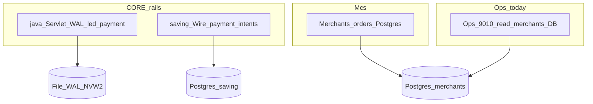
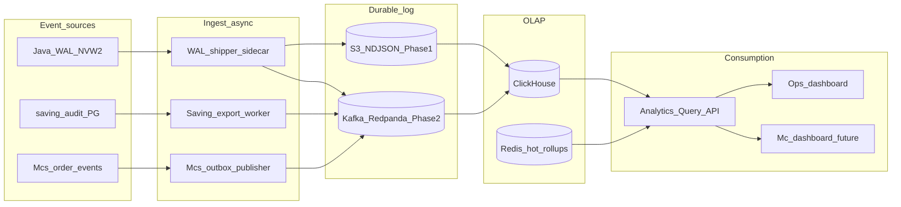

# Nivic Analytics Pipeline — Software Design Document

**EN:** Real-time and near-real-time analytics for **payment, tenant, and operations** — grounded in the nivic monorepo (dual CORE rails, Mcs, WAL). This is **not** a generic marketing-events template.

**VI:** Pipeline analytics **thanh toán, tenant, vận hành** — bám repo nivic (hai CORE rail, Mcs, WAL). **Không** phải mẫu SDD marketing chung.

**Status:** Proposed (Phase 0 — design; connectors not fully wired in runtime)

Related: [Downstream event contract](../downstream-event-contract.md), [WAL → ClickHouse](../analytics/wal-to-clickhouse.md), [ADR 004](../adr/004-dual-core-rails-java-and-saving.md), [Wire payment + multi-tenant](wire-payment-multitenant.md), [PRODUCT_PRINCIPLES §4](../PRODUCT_PRINCIPLES.md), [Ops control plane](../../Ops/README.md).

---

## 1. Overview & context

### 1.1 Problem

| Stakeholder | Need today | Pain |
|-------------|------------|------|
| **Platform ops** | Volume by `mid`, settlement windows, reconcile Merchants vs CORE | [`Ops/`](../../Ops/) reads Postgres `merchants`/`orders` only — no unified payment funnel |
| **Mc (merchant)** | Orders paid, GMV, drop-off on parked intents | Mcs `orders` lags CORE until `queryOrderStatus`; no cross-rail view |
| **Product / risk** | Accept→settle latency, idempotency retries, top-up funnel | Data split across **java** WAL, **saving** `payment_intents`, **Merchants** HTTP |
| **Compliance / finance** | Immutable audit trail, COA fund-flow (`coa_*`) | COA ledger ([`JdbcFundFlowLedger`](../../java/src/main/java/dev/nivic/coa/JdbcFundFlowLedger.java)) separate from Mc dashboards |

Legacy approach: **batch SQL on Postgres** (24h) or ad-hoc queries on production DB — unacceptable for campaign tuning and ops incident response, and **must not** load the payment hot path.

### 1.2 Goals (measurable)

| SLO | Target | Scope |
|-----|--------|--------|
| **Hot path isolation** | 0 extra sync I/O on accept/settle | Java `WalletAcceptService`, saving Wire handler |
| **Event durability** | ≥ 99.99% accepted Core events reach analytics store | After WAL / audit append |
| **Freshness** | P95 **≤ 60s** from Core accept → queryable rollup | Platform dashboard |
| **Query latency** | P95 **≤ 200ms** on pre-aggregated metrics | Ops / Mc API (not raw event scan) |
| **Throughput (year 1)** | **5k events/s** sustained, **25k/s** burst (product launch) | Sized for current stack; scale path documented |

Numbers are **nivic-realistic** (not a generic 100k/s marketing pipeline). Scale-out path targets **100k/s** via Kafka partitioning + ClickHouse cluster — Phase 4+.

### 1.3 Non-goals

- **Not** the financial source of truth (Core WAL + SQL ledger remain authoritative — [deterministic focus](../deterministic-focus.md)).
- **Not** Meilisearch replacement ([ADR 002](../adr/002-search-boundary-meilisearch.md) — discovery only).
- **Not** long-term cold archive design (hand off NDJSON/S3 to data science; retention policy only).
- **Not** merging `payment_intents` (saving) ↔ `led_payment` (java) in OLTP — analytics **unifies at event layer** only ([ADR 004](../adr/004-dual-core-rails-java-and-saving.md)).

---

## 2. Current state (as-is)



| Source | What exists | Analytics gap |
|--------|-------------|-----------------|
| **java/** | `WalService` → file WAL; JDBC `led_*`, `acct_*`; optional COA `coa_*` | No shipper; contract in [downstream-event-contract](../downstream-event-contract.md) only |
| **saving/** | `admin_audit`, transfer audit in Postgres; Wire sessions | No normalized export to warehouse |
| **Merchants/** | `orders`, `merchants`; auto-migrate on start | Ops aggregates SQL — no payment-rail correlation |
| **RabbitMQ** | TopupWorker async path ([`dev.sh`](../../dev.sh)) | Operational queue, **not** analytics bus today |
| **Ops/** | Overview, settlement, reconcile APIs | Merchants DB only; no Wire/java metrics |

---

## 3. Requirements

### 3.1 Functional (in scope)

1. **Unified event envelope** for all rails — `schema_version`, `event_type`, `occurred_at`, `payload` ([contract](../downstream-event-contract.md), [JSON Schema](../schemas/wallet_core_event_v1.schema.json)).
2. **Ingest** from (priority order):
   - Java WAL tail / batch shipper → durable log
   - Saving Postgres CDC or periodic audit export (Wire rail)
   - Mcs domain events (`order.paid`, `order.expired`) — **derived**, labeled non-authoritative for money
3. **Rollups** per `mid` / tenant: GMV, paid count, intent funnel, accept→settle latency, top-up success.
4. **Query API** for [`Ops/`](../../Ops/) UI extension and future Mc dashboard — **no direct ClickHouse from browser**.
5. **Tenant isolation** in storage and API (`mid` / `tenant_id` filter mandatory).

### 3.2 Non-functional

- **At-least-once** delivery; idempotent sink on `(event_type, mid, request_id, occurred_at)` or `raw_body_sha256`.
- **PII:** `extra_data` → Base64 or `extra_data_sha256` in analytics ([contract §2](../downstream-event-contract.md)).
- **Schema evolution:** additive JSON only per version; see contract §4.
- **Replay:** WAL remains replay source for java; analytics may rebuild from WAL + object store.

---

## 4. Technical choices (evaluated for nivic)

### 4.1 Ingestion bus

| Option | Fit for nivic | Decision |
|--------|---------------|----------|
| **A. Postgres logical replication → CH** | Low ops; lag on heavy Merchants writes; dual DBs (merchants, saving, nivic) | Supplementary for Mcs **only** |
| **B. RabbitMQ (already in `dev.sh`)** | Good for **task** queues (TopupWorker); weak for replay / long retention / multi-consumer fan-out | **Keep for async jobs**, not primary analytics bus |
| **C. Kafka / Redpanda** | Durable log, partition by `mid`, replay, multiple consumers (CH, alerts) | **Recommended** Phase 2+ |
| **D. NDJSON → S3 + ClickHouse S3 table** | Cheapest MVP from WAL batch | **Recommended Phase 1 MVP** |

**Recommendation:** **Phase 1:** WAL shipper → S3 NDJSON → ClickHouse `INSERT` / external table. **Phase 2:** same shipper → **Kafka/Redpanda** (avoid new RabbitMQ pattern for analytics). Rationale: matches [WAL → ClickHouse](../analytics/wal-to-clickhouse.md); RabbitMQ stays for top-up, not event history.

### 4.2 Analytics store

| Option | Fit | Decision |
|--------|-----|----------|
| **PostgreSQL JSONB** | Merchants/Ops already on PG; analytical scans contend with OLTP | **Reject** as primary warehouse |
| **Apache Druid** | Strong OLAP; heavy ops vs ClickHouse for SQL-first team | **Defer** — revisit if sub-second drill-down on 10B+ rows required |
| **ClickHouse MergeTree** | Already chosen in product docs; funnel SQL, per-tenant rollups | **Accept** |
| **ScyllaDB** | Hot `(mid, request_id)` lookups, rate counters | **Optional Phase 3** mirror ([wal-to-clickhouse](../analytics/wal-to-clickhouse.md)) |

### 4.3 Query layer

| Option | Decision |
|--------|----------|
| Dashboard → ClickHouse SQL directly | **Reject** — auth, cost, injection |
| **Ops Query API** (Go service or extend `Ops/`) | **Accept** — tenant-scoped REST, cached rollups |
| Embed in Merchants | Mc-scoped subset only (`mid` from JWT) — Phase 3 |

---

## 5. Proposed architecture



### 5.1 Data flow (happy path — servlet rail)

1. Partner POST → `WalletAcceptService` verifies HMAC → append **WAL** (sync, hot path).
2. **Async:** shipper reads WAL cursor → decode `SevletWalletCodec` → emit envelope `wallet.payload_accepted` ([contract](../downstream-event-contract.md)).
3. Bulk load **ClickHouse** `events_raw` + materialized view → `metrics_1m` (per `mid`, `event_type`, minute).
4. **Ops Query API** serves `GET /api/analytics/overview?from=&to=` → pre-aggregated rows; P95 target **< 200ms**.

Wire rail: same envelope shape where possible; add `rail = "wire" | "servlet"` in payload extensions (additive, same `schema_version`).

### 5.2 Dual-rail normalization

Do **not** JOIN `payment_intents` ↔ `led_payment` in the warehouse. Instead:

| `event_type` | Source | Authoritative for money |
|--------------|--------|------------------------|
| `wallet.payload_accepted` | java WAL | Yes (servlet) |
| `wire.intent_settled` | saving export | Yes (Wire) |
| `mcs.order_paid` | Merchants | No — correlates via `gateway_order_id` / `wire_request_id` |
| `coa.journal_posted` | java `coa_*` (optional) | Platform fund-flow only |

Correlate in dashboards with **shared keys:** `mid`, `request_id`, `order_id`, `occurred_at` window — document mismatch when Mcs marks PAID before CORE poll completes ([wire-payment-multitenant §6](wire-payment-multitenant.md)).

---

## 6. Event catalog (v1)

| `event_type` | Producer | Key fields in `payload` |
|--------------|----------|-------------------------|
| `wallet.payload_accepted` | WAL shipper | [contract v1](../downstream-event-contract.md) |
| `wallet.confirm_settled` | WAL shipper | + `intent_status`, `currency_code` |
| `wire.intent_created` | saving export | `mid`, `request_id`, `amount`, `gateway_order_id` |
| `wire.intent_settled` | saving export | + `debit_uid`, `credit_uid` (strings) |
| `mcs.order_paid` | Merchants outbox | `mid`, `order_id`, `amount`, `wire_request_id`, `paid_at` |
| `topup.card_requested` | Cards → RabbitMQ bridge | `uid`, `amount`, `card_id` (no PAN) |
| `topup.wire_credited` | TopupWorker | `uid`, `amount`, `request_id` |

New types: register in `docs/schemas/` + bump `schema_version` only on breaking changes.

---

## 7. ClickHouse schema (sketch)

```sql
-- Raw facts (90 day TTL)
CREATE TABLE events_raw (
  event_date Date,
  occurred_at DateTime64(3, 'UTC'),
  schema_version UInt16,
  event_type LowCardinality(String),
  rail Enum8('servlet' = 1, 'wire' = 2, 'mcs' = 3),
  mid UInt32,
  request_id UInt64,
  order_id String,
  amount_minor Int64,
  currency_code FixedString(3),
  input_command LowCardinality(String),
  extra_data_sha256 FixedString(64),
  ingest_id UUID
) ENGINE = MergeTree()
PARTITION BY toYYYYMM(event_date)
ORDER BY (mid, event_type, occurred_at);

-- 1-minute rollups (query API primary)
CREATE TABLE metrics_1m (
  bucket DateTime,
  mid UInt32,
  event_type LowCardinality(String),
  event_count UInt64,
  amount_sum Int64
) ENGINE = SummingMergeTree()
PARTITION BY toYYYYMM(bucket)
ORDER BY (mid, event_type, bucket);
```

Materialized view: `events_raw` → `metrics_1m`. Ops queries **always** hit `metrics_1m` or `metrics_1h` unless debugging.

---

## 8. Query API (Ops integration)

Extend [`Ops/handler.go`](../../Ops/handler.go) or add **`Analytics/`** sidecar:

| Endpoint | Auth | Description |
|----------|------|-------------|
| `GET /api/analytics/overview` | `OPS_TOKEN` | Platform GMV, paid orders, active `mid` count (time range) |
| `GET /api/analytics/merchants/{mid}/summary` | `OPS_TOKEN` | Per-Mc funnel + volume |
| `GET /api/analytics/latency/accept-settle` | `OPS_TOKEN` | P50/P95 from paired events |

**Caching:** Redis key `rollup:{mid}:{bucket}` TTL 30s for dashboard refresh.

**Mc-facing (Phase 3):** same shapes, JWT scoped to single `mid` — served from Merchants BFF, not Ops token.

---

## 9. SLO definitions (avoid template ambiguity)

| Metric | Definition | Target |
|--------|------------|--------|
| **Ingest ACK** | Shipper committed offset after WAL record | P95 < 5s lag behind WAL tip |
| **Freshness** | `occurred_at` → row in `metrics_1m` | P95 < 60s |
| **Query** | Ops UI request → JSON response | P95 < 200ms on rollups |
| **Completeness** | Compare daily `wallet.payload_accepted` count vs WAL line count | ≥ 99.99% |

Hot path: **no** analytics callback in `WalletAcceptService` accept thread — mirror pattern only via async bridge (see [`WalletAcceptMirrorTest`](../../java/src/test/java/dev/nivic/coa/bridge/WalletAcceptMirrorTest.java) for COA; analytics shipper is separate concern).

---

## 10. Security & tenancy

- **Ops token** ≠ Mc JWT; never expose ClickHouse credentials to clients.
- **RLS analog:** every Query API SQL includes `WHERE mid = ?` or allowed `mid` list.
- **PII:** no raw `extra_data` in CH unless Mc contract opts in; default SHA-256.
- **Signed WAL (NVW2):** shipper verifies before emit ([`SignedWalVerifier`](../../java/src/main/java/dev/nivic/wal/SignedWalVerifier.java)).

---

## 11. Implementation phases

| Phase | Duration | Deliverables |
|-------|----------|--------------|
| **0 — Design** | Done | This SDD, envelope contract, CH DDL in repo |
| **1 — MVP** | **In progress** | ✅ `WalShipper` + `WalShipperMain` (java) → local NDJSON; cursor file; `WalShipperTest`. ☐ S3 upload; CH single node; Ops SQL script |
| **2 — Bus** | Weeks 3–4 | Kafka/Redpanda; saving audit exporter; idempotent CH consumer; lag dashboards |
| **3 — Query API** | Week 5 | Ops `/api/analytics/*`; Redis cache; integration tests |
| **4 — Mc dashboard** | Week 6+ | Merchants BFF routes; 10% Mc beta |
| **5 — Scale** | As needed | CH cluster, 100k/s partition plan, optional Scylla hot path |

**Prerequisites:** Postgres remains OLTP; [`java/dev-java.sh`](../../java/dev-java.sh) for servlet dev; [`saving/`](../../saving/) admin audit for Wire smoke.

---

## 12. Alternatives considered (summary)

| Generic template choice | Nivic decision | Why |
|-------------------------|----------------|-----|
| REST ingest 100k/s from clients | **Reject** | Events originate **inside** Core/Mcs, not public firehose |
| Kafka day one | **Defer** | S3 batch MVP matches existing WAL-first docs |
| Druid | **Defer** | ClickHouse already in [PRODUCT_PRINCIPLES](../PRODUCT_PRINCIPLES.md) |
| Dashboard → OLAP SQL | **Reject** | Query API + rollups |

---

## 13. Open questions

1. **Single ClickHouse cluster** vs per-env — staging may use CH Cloud smallest tier.
2. **Saving CDC:** Debezium on `saving` DB vs nightly audit export for Phase 1.
3. **COA analytics:** separate `coa_*` rollup for finance ops vs unified `events_raw`.
4. **Legal hold:** NVW2 blob retention in S3 — duration TBD with compliance.

---

## 14. References (in repo)

- [Downstream event contract](../downstream-event-contract.md)
- [WAL → ClickHouse](../analytics/wal-to-clickhouse.md)
- [ADR 004: Dual CORE rails](../adr/004-dual-core-rails-java-and-saving.md)
- [Deterministic focus](../deterministic-focus.md)
- [Ops README](../../Ops/README.md)
- JSON Schema: [`docs/schemas/wallet_core_event_v1.schema.json`](../schemas/wallet_core_event_v1.schema.json)
