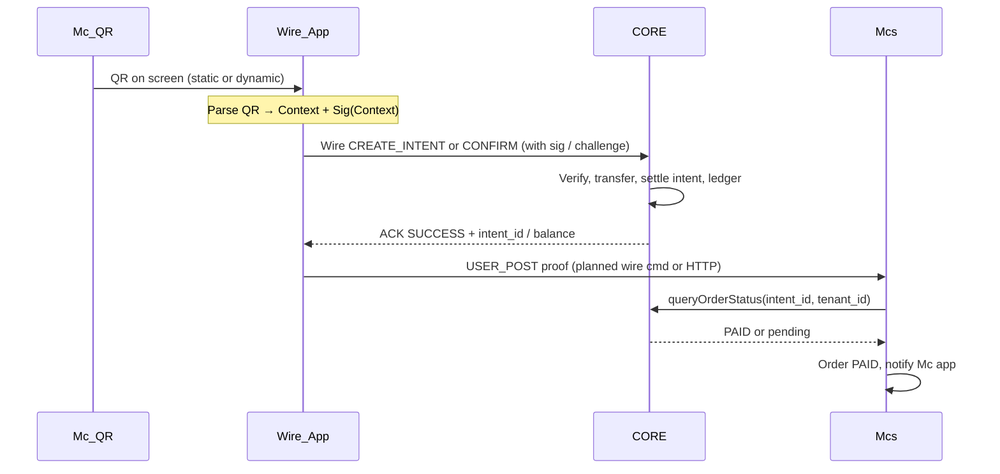

# Wire payment + Multi-tenant Mc (canonical) / Luồng thanh toán & đa tenant

**EN:** Single document for how **Wire App**, **Wire Server (CORE)**, and **Mcs** (`Merchants/`) work together — **not** MoMo/Shoptify server-to-server order APIs, **not** browser `returnUrl` redirects. Communication is **binary Wire TCP** + optional **HTTP** callbacks; merchants mostly expose **QR** and wait for the app.

**VI:** Một tài liệu cho **Wire App**, **Wire Server (CORE)**, và **Mcs** (`Merchants/`) — **không** kiểu MoMo/Shoptify gọi API tạo order server-to-server, **không** redirect trình duyệt. Giao tiếp chính là **Wire TCP nhị phân** + HTTP tùy chọn; merchant chủ yếu **show QR** chờ app.

Terminology: **Mc** (*Mờ Cê*), **Mcs** (*Mờ C S*), **CORE** = `saving/` Wire TCP + `payment_intents` + ledger.

Related: [Wire ≠ MoMo](../wire-vs-momo.md), [Multi-tenant Mcs](../multi-tenant-mcs.md), [Payment flow (mini-app)](../payment-flow-miniapp.md).

---

## 1. Design principles / Nguyên tắc

| Principle | Meaning |
|-----------|---------|
| **Client-driven** | Merchant **does not** call CORE to “create order” before the customer pays. Merchant shows **QR**; **Wire App** drives scan → intent → pay. |
| **No browser redirect** | After pay, **USER POST** (native background) delivers proof to Mcs — not `window.location` / `returnUrl` from a web view. |
| **CORE owns money** | Intent, verify, ledger, `payment_intents` live in **CORE**. Mcs does **not** hold authoritative balances. |
| **Merchant polls CORE** | After USER POST, **Mcs** calls **`queryOrderStatus`** (or internal equivalent) — CORE does **not** push webhooks to merchants by default. |
| **Shared DB + `mid`** | Multi-tenant isolation by **`mid` / `tenant_id`** on rows (see [ADR 003](../adr/003-neo-bank-mid-and-merchant-id.md)). |
| **Crypto-first** | QR / wire payloads carry **signatures**; untrusted client data is never enough to mark PAID. |

---

## 2. Actors / Vai trò

| Actor | Repo | Role |
|-------|------|------|
| **Wire App** | `wire-android/`, `saving-ios/` | Customer: scan QR, `CREATE_INTENT` / `CONFIRM_INTENT`, receive ACK. |
| **CORE** | `saving/` | Wire TCP, sessions, transfers, `payment_intents`, ledger, idempotency. |
| **Mcs** | `Merchants/` | Mc orders, menu, loyalty, web entry (`*.nivic.dev`), deeplink helpers. Postgres: [`tenant_bills` + RLS](../Merchants/migrations/001_tenant_bills.up.sql). |
| **Java Core** (optional) | `java/` | Separate HTTP wallet path (`payment_ledger`, WAL) for some mids — **not** the same TCP session as Wire App today. |

---

## 3. End-to-end flow (target) / Luồng chuẩn (mục tiêu)



### Step-by-step (your model) / Từng bước

1. **Mc** shows **QR** (in-house Mcs stall or external POS — same for Wire camera).
2. **Wire App** scans → builds **Context + Sig(Context)** (from QR bytes / deeplink; see §4).
3. **App → CORE:** payment intent command over **Wire TCP** (HMAC-framed).
4. **CORE:** verify signature, debit user, credit Mc wallet, **`payment_intents.status = settled`**, immutable ledger row.
5. **CORE → App:** success ACK (binary).
6. **App → Mcs:** **USER POST** — deliver proof (`intent_id`, `tenant_id`, `core_sig`, …). **No** reliance on browser redirect.
7. **Mcs → CORE:** **`queryOrderStatus`** — only CORE is source of truth for “money really moved”.
8. **Mcs:** mark order PAID, push to **Mc merchant app** (socket/FCM).

### What is explicitly NOT required / Không bắt buộc

- Merchant HTTP **“create order”** on CORE before QR is shown.
- Mcs **generating** payment signatures (target: CORE or QR-bound keys; today see §6).
- CORE **calling back** merchant on every payment (today: optional `gateway_notify_async` after settle — §6).

---

## 4. QR and deeplinks / QR và deeplink

### Intent QR (primary for mini-app pay)

```
saving://intent?mid={mid}&rid={request_id}&amount={amount}&oid={order_id}
```

| Field | Type | Notes |
|-------|------|--------|
| `mid` | u32 | Mc tenant |
| `rid` | u64 | Must match row in `payment_intents` after `CREATE_INTENT` / idempotency |
| `amount` | u64 | Minor units |
| `oid` | string | Mcs `order_id` / gateway id (maps to `gateway_order_id` in CORE) |

Implemented: Android `IntentPayload`, Mcs `wireIntentURL`, `saving` `handle_confirm_intent`.

### Store entry (browse Mc in Wire)

```
saving://store?mid={mid}
https://{slug}.nivic.dev
```

### Legacy counter QR (still supported)

```
saving://pay?pr={base64url_payment_request}
saving://pay?mid=&amount=&ref=
```

Use for **counter / POS reprint**, not the primary superapp web→store path (see [Wire ≠ MoMo](../wire-vs-momo.md)).

---

## 5. Wire frame layout (implemented) / Khung Wire (đã có)

All multi-byte fields are **big-endian**. Layout matches `wire-android/.../WireFrame.kt` and `saving/include/wire.h`.

```
┌────────────┬────────┬────────┬──────────────────┬─────────────┐
│ len (u32)  │ type   │ seq    │ body             │ hmac (32)   │
│ 4 bytes    │ 1 byte │ 4 bytes│ variable         │ SHA-256     │
└────────────┴────────┴────────┴──────────────────┴─────────────┘
```

`len` = length of **body + 32** (signature), not including the 9-byte header.

### Commands used in payment flow

| `type` (hex) | Name | Direction | Body (summary) |
|--------------|------|-----------|----------------|
| `0x20` | `CREATE_INTENT` | App → CORE (merchant session) | `[merchant_token 32][request_id 8][order_id 8][amount 8][gateway_order_id?]` |
| `0x29` | `CONFIRM_INTENT` | App → CORE (customer session) | `[customer_token 32][merchant_id 4][request_id 8]` |
| `0x21` | `PAY_INTENT` | App → CORE (customer + TOTP) | TOTP path |
| `0x82` | `ACK` | CORE → App | `[code 1][extra…]` |

Merchant session `CREATE_INTENT` ACK extra (21 bytes): `[status 1][mid 4][request_id 8][amount 8]` — used to build intent QR on Mc terminal.

Customer `CONFIRM_INTENT` uses existing open intent for `(mid, request_id)` from QR.

---

## 6. Planned: USER POST proof packet / Dự kiến: gói USER POST

When CORE returns success, **App** should push proof to **Mcs** without opening a browser.

**Suggested wire command** (e.g. `0x2A` — reserve in your opcode map):

| Offset | Field | Size | Description |
|--------|-------|------|-------------|
| 0 | `intent_id` | 16 | CORE intent key (or opaque id) |
| 16 | `tenant_id` | 4 | Mc `mid` |
| 20 | `bill_id` | 8 | Mc order id |
| 28 | `amount` | 8 | Amount confirmed |
| 36 | `core_sig` | 64 | Ed25519 or HMAC proof from CORE receipt |
| 100 | `proof_payload` | var | Optional extension |

**Until this exists on Wire**, Android uses HTTP:

- `POST /orders/{oid}/confirm` with `paid_by` ([`MerchantsClient.confirmPaid`](../../wire-android/app/src/main/java/dev/nivic/wire/data/MerchantsClient.kt))
- CORE may also fire **`gateway_notify_async`** → same endpoint ([`saving/src/handlers.c`](../../saving/src/handlers.c)) — server-initiated, not USER POST.

---

## 7. CORE data model / Dữ liệu CORE

PostgreSQL ([`saving/src/db.c`](../../saving/src/db.c)):

```sql
payment_intents (
  mid BIGINT,
  request_id BIGINT,
  order_id BIGINT,
  amount BIGINT,
  status SMALLINT,          -- 0 = open, 1 = settled
  gateway_order_id TEXT,  -- Mcs order id string
  ...
  PRIMARY KEY (mid, request_id)
);
```

**Multi-tenant rule:** every query must filter by **`mid`** (and idempotency on `(mid, request_id)` in `handle_create_intent`).

**Ledger:** transfers + `db_ledger_append` on settle ([`handle_confirm_intent`](../../saving/src/handlers.c)).

---

## 8. Mcs responsibilities / Trách nhiệm Mcs

| Concern | Owner |
|---------|--------|
| Mc profile, menu, orders (pending/paid UI) | **Mcs** SQLite + HTTP API |
| Authoritative “did money move?” | **CORE** only |
| Deeplink generation | [`Merchants/wire_urls.go`](../../Merchants/wire_urls.go) |
| After settle notification | HTTP confirm + optional push (Mc app) |

**Internal poll API (target):**

```
GET /pay/{order_id}/wire     → intent_url, mid, request_id, status hint
```

Implemented: [`handlePayOrderWire`](../../Merchants/handlers.go).

**queryOrderStatus (target internal contract):**

```
Input:  tenant_id, intent_id (or mid + request_id)
Output: status ∈ { PENDING, PAID, NOT_FOUND }
```

Not yet a dedicated public RPC document — implement as internal HTTP/gRPC from Mcs → CORE when splitting services.

---

## 9. Multi-tenant storage choice / Chọn lưu trữ đa tenant

| Model | Nivic choice |
|-------|----------------|
| DB per tenant | No — ops cost |
| Schema per tenant | Optional for large external Mc later |
| **Shared DB + `mid`** | **Yes** — `payment_intents`, Mcs `orders.mid`, Java `merchant_config.mid` |

**Isolation checklist:**

- [ ] Every SQL: `WHERE mid = ?` or Postgres **RLS** `app.current_tenant_id`
- [ ] Wire handlers: merchant token / customer token bound to session
- [ ] Mcs HTTP: `X-Merchant-Token` per Mc
- [ ] Rate limits / noisy neighbor: per-`mid` (future)

---

## 10. Implemented vs target / Đã có vs mục tiêu

| Item | Status |
|------|--------|
| QR `saving://intent` + `CONFIRM_INTENT` | **Done** |
| Cold start deeplink `store` / `intent` / `https://…/pay/…` | **Done** (Android + Mcs `/pay/.../wire`) |
| Mcs `intent_url` on create order APIs | **Done** |
| USER POST as dedicated Wire opcode | **Planned** (HTTP `confirmPaid` today) |
| Mcs `queryOrderStatus` RPC | **Planned** (logic = confirm + DB read today) |
| CORE signs Context at step 2 (merchant-agnostic API) | **Partial** — Ed25519 on `pay?pr`; intent path uses session + challenge |
| Universal cart / cross-Mc cart | **Out of scope** (product choice) |
| External Mc zero integration beyond QR + poll | **Supported** via same QR + `gateway_order_id` |

---

## 11. Comparison (why not MoMo) / So với MoMo

| Topic | MoMo-style | Nivic target |
|-------|------------|--------------|
| Merchant integration | Each partner WebView / mini-app | **One Wire app**, Mc = QR + stall |
| Create payment | Server calls wallet API first | **User app** drives Wire after QR |
| Return to merchant | Redirect URL in browser | **USER POST** to Mcs |
| Money truth | Partner-specific | **CORE ledger** |
| Merchant checks payment | Webhook from wallet | **`queryOrderStatus`** |

---

## 12. Repo map / Bản đồ repo

```
wire-android/     Wire App (customer) — WireFrame, deeplink, PaymentConfirmSheet
saving/           CORE — TCP, payment_intents, transfers, gateway_notify → Mcs
Merchants/        Mcs — orders, wire_urls, slug pages, /pay/.../wire
java/             Optional servlet wallet (separate rail)
docs/downstream-event-contract.md   Analytics export shape
```

---

## 13. Next implementation order / Thứ tự code gợi ý

1. **Mcs `queryOrderStatus`** internal API reading CORE DB (or read replica).
2. **Wire opcode `USER_POST_PROOF`** + handler on Mcs matching §6.
3. Optional: CORE HTTP **verify intent** for external Mc (API key), same as internal poll.
4. Postgres **RLS** on `payment_intents` if multiple services touch DB.

---

## Read more / Đọc thêm

- [Product principles §3](../PRODUCT_PRINCIPLES.md) — many stalls, one ruleset
- [Deterministic focus](../deterministic-focus.md) — WAL vs TCP truth
- [Downstream event contract](../downstream-event-contract.md) — analytics envelope
