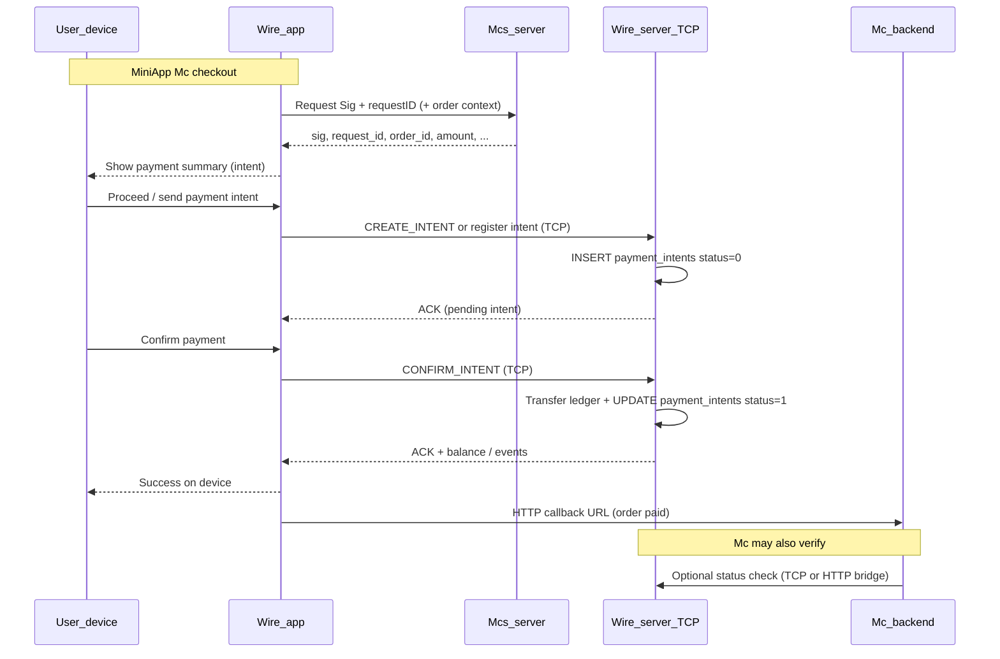

# Payment flow: MiniApp → Wire → Mcs / Luồng thanh toán MiniApp

**EN:** Canonical **Wire superapp** payment path from a **Mc** mini-app (`FrontStoreSheet`) through **Mcs** (order + signature) to **Wire Server** (TCP, `payment_intents`, ledger), then back to **Mcs** for order status.

**VI:** Luồng thanh toán chuẩn từ **mini-app Mc** trong Wire, qua **Mcs** (đơn + chữ ký), lên **Wire Server** (TCP, `payment_intents`, sổ cái), rồi báo lại **Mcs**.

Terminology: **Mc** (*Mờ Cê*), **Mcs** (*Mờ C S*) — see [Wire ≠ MoMo](wire-vs-momo.md).

---

## Canonical sequence (product) / Trình tự chuẩn (sản phẩm)

### Steps in plain language / Từng bước

| Step | EN | VI |
|------|----|----|
| 1 | User pays from **Mc mini-app** inside Wire; Wire asks **Mcs** for **Sig** and **requestID** (and order binding). | User thanh toán từ **mini-app Mc**; Wire gọi **Mcs** xin **Sig** và **requestID** (gắn đơn). |
| 2 | User sees amount/order; Wire sends **payment intent** to **Wire Server** over **TCP**. | User thấy đơn/tiền; Wire gửi **intent thanh toán** lên **Wire Server** qua **TCP**. |
| 3 | Wire Server persists **`payment_intents`** with **initial status** (pending). | Wire Server ghi **`payment_intents`**, **status khởi tạo** (chờ). |
| 4 | User taps **confirm**; Wire Server **updates ledger**, **settles intent**, returns result to **device**. | User **xác nhận**; server **cập nhật sổ cái**, **settle intent**, trả kết quả **device**. |
| 5 | Device notifies **Mc** (HTTP URL / order id) so **Mcs** order shows **paid**. | Device gửi **Mc** (URL) cập nhật **đã thanh toán** trên **Mcs**. |
| 6 | **Mc** may **call back** Wire Server to **verify** intent status (reconciliation). | **Mc** có thể **gọi ngược** Wire Server **đối soát** trạng thái intent. |

---

## Wire Server: `payment_intents` / Bảng intent

Implemented in **saving** (C + Postgres), not Java `payment_ledger`:

| Column | Role |
|--------|------|
| `(mid, request_id)` | Primary key; idempotency with `(mid, request_id)` gate |
| `order_id` | Wire-side order key; dedup per `(mid, order_id)` |
| `amount` | Minor units |
| `status` | `0` = pending (initial), `1` = settled |
| `gateway_order_id` | **Mcs** order id string → used to `POST /orders/{id}/confirm` |

Code: [`saving/src/db.c`](../saving/src/db.c) (`payment_intents`), [`handle_create_intent`](../saving/src/handlers.c), [`handle_confirm_intent`](../saving/src/handlers.c).

---

## TCP commands (Wire Server) / Lệnh TCP

| Command | Who | Effect |
|---------|-----|--------|
| `CREATE_INTENT` | Mc session (merchant token) today | Insert pending row; ACK carries `mid`, `request_id`, `amount` for QR / deeplink |
| `CONFIRM_INTENT` | Customer session | `db_transfer` + `db_intent_settle` + `gateway_notify_async` |
| `PAY_INTENT` | Customer + TOTP | Same settle path for counter/TOTP QR |

Customer confirm from mini-app: **`CONFIRM_INTENT`** — [`PaymentConfirmSheet.kt`](../wire-android/app/src/main/kotlin/app/saving/wire/ui/PaymentConfirmSheet.kt) → `SavingClient.confirmIntent`.

---

## Mcs integration / Tích hợp Mcs

| Concern | Mechanism today | Notes |
|---------|-----------------|-------|
| **Sig** | Ed25519 **`PaymentRequest`** (`mid`, `order_id`, `amount`, `ts`, `sig`) | [`Merchants/handlers.go`](../Merchants/handlers.go) `buildPaymentRequest`; verify via `POST /payment_request/verify` |
| **Order on Mcs** | SQLite orders + `POST /orders/{oid}/confirm` | `handleConfirmOrder`, `X-Wire-Token` |
| **Notify Mcs after settle** | Wire Server → `POST /orders/{gateway_order_id}/confirm` | [`gateway_notify_async`](../saving/src/handlers.c) (localhost:8090) |
| **Device → Mcs** | `MerchantsClient.confirmPaid(orderID, paidBy)` | After `confirmIntent` in app — [`confirmPaid`](../wire-android/app/src/main/kotlin/app/saving/wire/data/MerchantsClient.kt) |

**Target (step 1 in diagram):** Wire app calls **Mcs** to mint **Sig + requestID** *before* user submits intent on TCP — align with checkout in `FrontStoreSheet`, not only Mc-terminal `CREATE_INTENT`.

---

## What exists vs target / Hiện tại vs mục tiêu

| Step in canonical flow | In repo today |
|------------------------|---------------|
| Mcs → Sig + requestID for **customer** checkout | **Partial:** `intent_url` + `request_id` on order APIs; `pr`+sig legacy; Mc still **`CREATE_INTENT`** on Wire before confirm |
| User → Wire → TCP intent, `status=0` | **Yes** — Mc **`CREATE_INTENT`**; deeplink **`saving://intent`** + cold start ([`SavingDeeplink.kt`](../wire-android/app/src/main/kotlin/app/saving/wire/deeplink/SavingDeeplink.kt)) |
| User confirm → ledger + `status=1` | **Yes** — `CONFIRM_INTENT` / `PAY_INTENT` |
| Device → Mcs URL update | **Yes** — `confirmPaid` + server `gateway_notify_async` |
| Mc verify on Wire Server | **Partial** — Mcs has order status DB; dedicated **Wire verify API** for Mc callback TBD |

### Two paths still live / Hai nhánh đang chạy

1. **Intent / superapp (target):** `saving://intent?...` → `FrontStoreSheet` → `CONFIRM_INTENT` → Mcs confirm.
2. **Legacy QR:** `saving://pay?pr=...` → scan → `payMerchant` (transfer) + optional `confirmPaid` — see [Wire ≠ MoMo](wire-vs-momo.md).

---

## Java Core (separate) / Core Java (tách riêng)

Order-payment with WAL + `payment_ledger` + `CoreLedgerStatus` lives in **`java/`** ([Sevlet wallet](adr/001-sevlet-wallet-wire.md)). The **Wire app + saving TCP** path above uses **`payment_intents`** on the Wire Server DB. Do not assume one table serves both without an explicit bridge.

---

## Read more / Đọc thêm

- [Wire payment + multi-tenant (canonical)](architecture/wire-payment-multitenant.md)
- [Wire ≠ MoMo](wire-vs-momo.md)
- [Product principles](PRODUCT_PRINCIPLES.md)
- [Deterministic focus](deterministic-focus.md)
